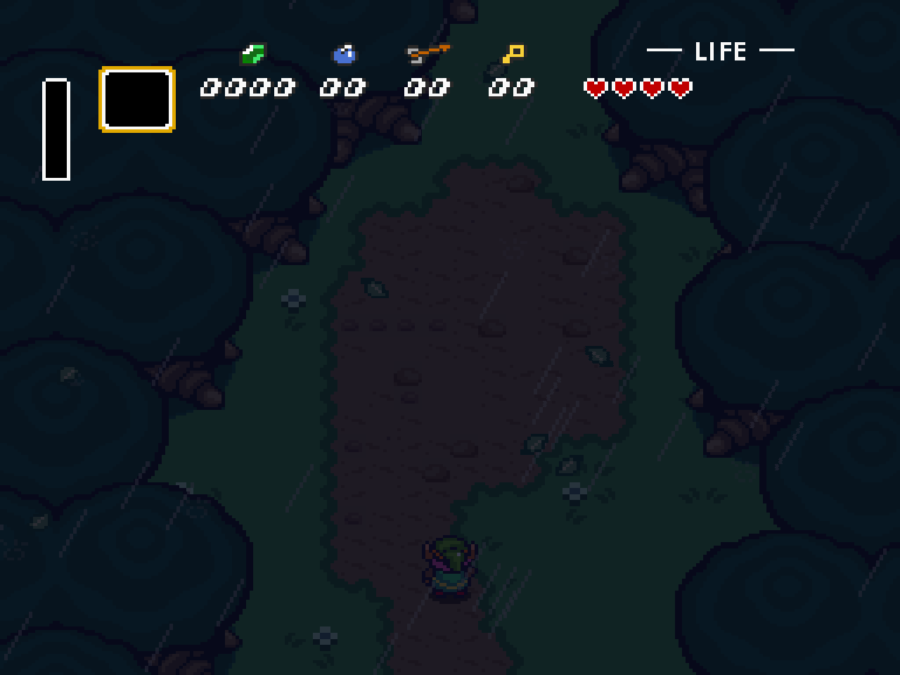
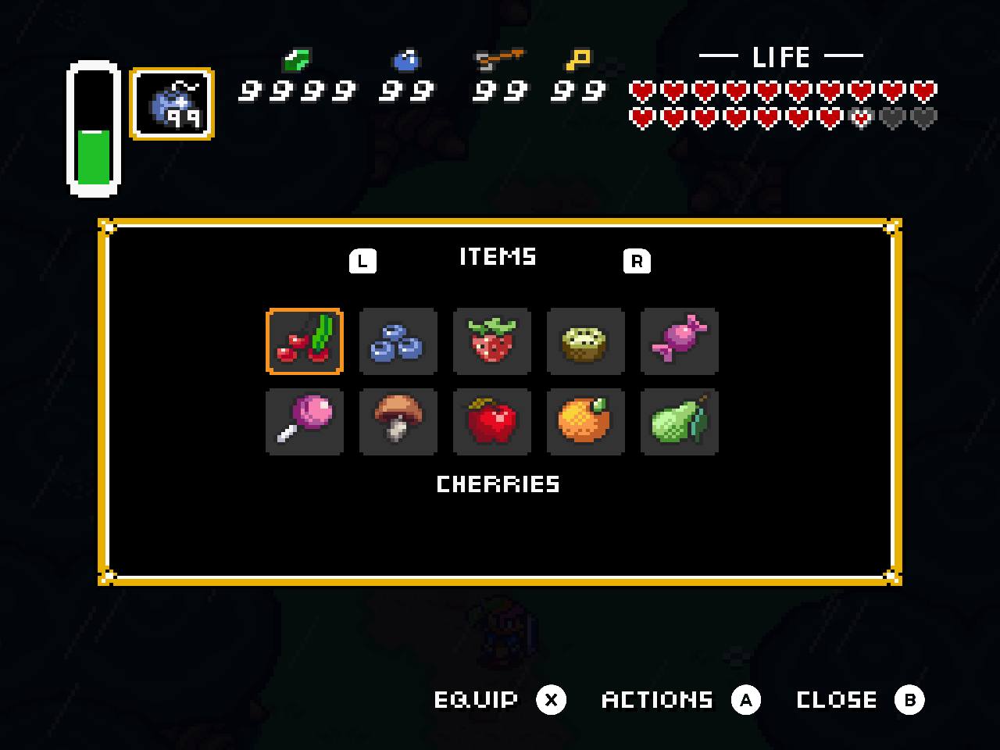
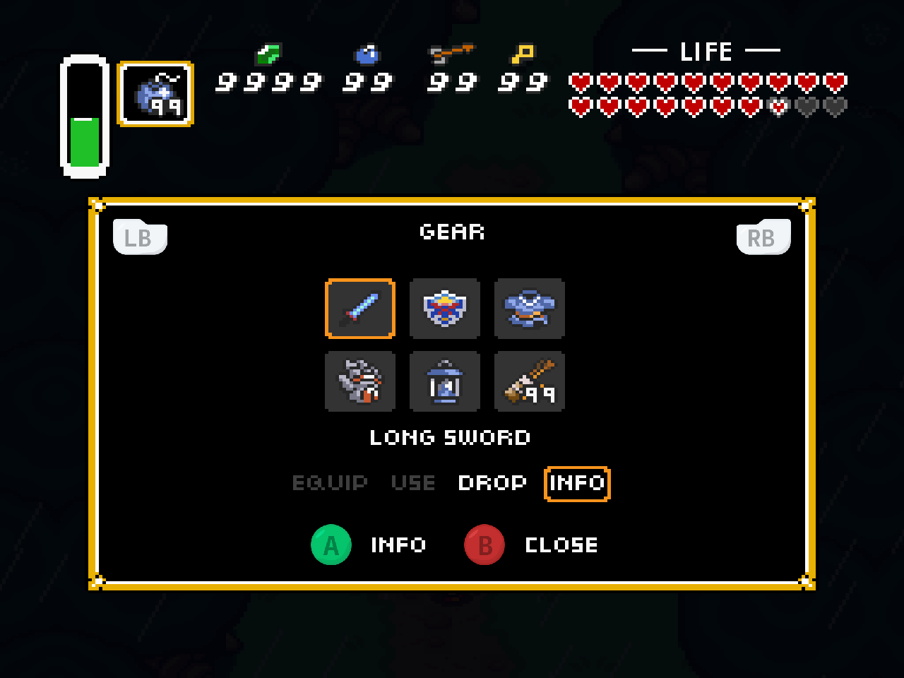
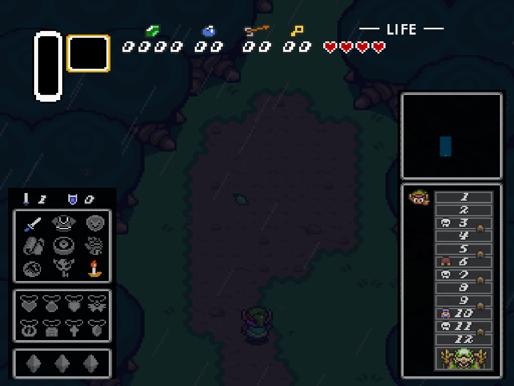
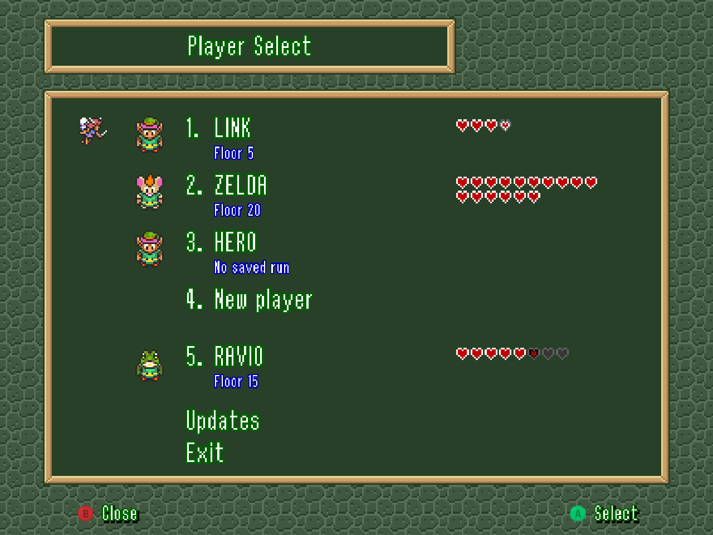

# Dungeons of Infinity: 4:3 edition

**The full dungeon on your Retroid Nova.**

Play Dungeons of Infinity fullscreen on ROCKNIX, with a classic Zelda HUD and a layout made for the Nova's 4:3 display. Keep health, magic, your active item, and supplies in view. Click the right stick when you need equipment, the map, or dungeon progress.

[**Download the installer**](https://github.com/saschb2b/The-Legend-of-Zelda-Dungeons-of-Infinity-4-3/releases/latest) · [Installation](#install-on-the-nova) · [Controls](#controls) · [What's changed](CHANGELOG.md)



- The complete playfield fills the display. Title screens and menus fit too.
- Health and supplies stay visible while status panels open over the game.
- Selected updates from the newer game include inventory bags, sword poke and spin, Topaz, adjustable challenges, and Wallmaster mode.

## Install on the Nova

You need ROCKNIX, PortMaster, Wi-Fi, and about 300 MiB of free space.

1. Download the **Nova patch installer ZIP** from the [latest release](https://github.com/saschb2b/The-Legend-of-Zelda-Dungeons-of-Infinity-4-3/releases/latest).
2. Extract the ZIP and copy both items into `/storage/roms/ports/`:

   ```text
   ports/
   ├── Install Zelda Dungeons of Infinity 4-3.sh
   └── zeldadoi-43-installer/
   ```

3. Refresh the game list and run **Install Zelda Dungeons of Infinity 4-3** from Ports.
4. Wait for installation to finish, then launch **Zelda Dungeons of Infinity 4-3**.

The installer downloads the official PortMaster package and applies the patch automatically. You do not need to download or patch game files yourself.

**Updating:** close the game, replace the installer files with the newer download, and run the installer again. Your saves stay in `zeldadoi-43/savedata/`. The installer preserves them and keeps migration backups in `zeldadoi-43/save-backups/`.

If installation fails, check `zeldadoi-43-installer/install.log`. For another attempt, run the installer again.

## Controls

These are the default controller bindings. Change them under **Controls**. Each button hint follows your current mapping, including keyboard bindings.

| Button | During play | In the inventory |
| --- | --- | --- |
| D-pad / left stick | Move | Highlight an object or action |
| A | Interact | Open Actions, open a bag, or confirm the highlighted action |
| B | Sword | Close the current view |
| X | Use the equipped item | Equip the highlighted object, when available |
| Y | Open the map | |
| Start | Open the inventory | Close the inventory |
| Select | Pause | Close the inventory |
| Right-stick click | Show or hide Status | |
| LB / RB | | Previous / next inventory page |
| Select + Start | Exit to Ports | Exit to Ports |

Press **B** to close the map, menus, item information, or inventory. Closing an action list or item information returns to the inventory. Closing a pause submenu returns to the pause menu. In name entry, B deletes a letter. On a keyboard, Escape closes or cancels the current view.

At a shop counter, press **A** to inspect an item. In its dialog, A confirms the highlighted choice and **B** closes without buying. Closing also works while reading item information or a purchase refusal.

**Actions** opens an object's choices. **Equip** assigns it to the active item button. **Use** activates or consumes it immediately. Gear in dedicated equipment slots is already active. Its action list provides information and, where allowed, Drop.

Use **LB/RB** to switch inventory pages, or **Page Up/Page Down** on a keyboard. The D-pad stays in the item grid. Health and counters remain visible while browsing or reading item information.

The footer keeps Equip on the left, Close in the middle, and the primary action on the right. Available actions appear without moving the other hints. The shoulder hints also stay fixed as page titles change.

| Inventory below the HUD | Contextual item actions |
| --- | --- |
|  |  |

The bag screenshot uses a populated test inventory to show full counters and two rows of hearts. All screenshots come from the game running on a Nova.

| Status at a stick-click | Menus that fit the screen |
| --- | --- |
|  |  |

## Playing and updating

Hold Sword after a swing to poke while moving. With a level-three sword or higher, hold until the blade flashes, then release to spin. Level-two swords can break pots.

Open **Challenges** before a run to adjust health, darkness, inventory space, shop prices, and other restrictions. The last page includes No map, No food, and Wall Master. Existing runs keep their original challenge restrictions.

Press Start or confirm to skip the opening title animation. To require the full animation, set `CanSkipTitle=0` under `[Preferences]` in `zeldadoi-43/savedata/options.ini`.

This is an unofficial patch of the PortMaster **1.1.6 VM** build with selected 1.2.x backports. It does not include every change from 1.2.1. Read the [backport audit](BACKPORTS.md) for coverage and the [changelog](CHANGELOG.md) for changes between patch releases.

<details>
<summary>Save migration and returning to an older patch</summary>

Existing inventory migrates on load. Excess items remain available on overflow pages.

The installer preserves saves before each format change:

- `save-backups/before-inventory-v1.zip`: before the inventory update.
- `save-backups/before-content-v3.zip`: before Topaz and variable challenges.

Reinstallation preserves both backups. Keep them if you plan to return to an earlier patch, which may require the matching older saves.

</details>

## Development and testing

The repository distributes patch code and binary deltas. Installer downloads contain no standalone game or runtime. Checksums verify the upstream package and patched output.

[TESTING.md](TESTING.md) covers builds, GitHub CI, the isolated Nova regression suite, and the release procedure. Patch versions are independent of the original game's versions. Related fixes stay under Unreleased until the batch is ready.

<details>
<summary>Build the patch on Linux</summary>

Use Linux x86-64 and Python 3.11 or newer:

```sh
python3 -m unittest discover -v
python3 build.py --check-release --runtime-tests
```

The build downloads the pinned PortMaster package and UndertaleModTool CLI 0.9.2.0, checks their hashes, and compiles the patch. It verifies the checked-in delta against the clean build, then tests installation and reinstallation. Full game archives stay in the ignored `.build/` directory.

GitHub Actions runs the unit suite and build checks on pushes and pull requests. Runtime assertions run separately on a Nova. The installer uses Python's standard library. Release packaging uses `requirements-build.txt`.

</details>

<details>
<summary>Rendering and device support</summary>

Testing covers the Retroid Nova on ROCKNIX. The launcher selects Freedreno and SDL's evdev controller backend.

Gameplay presents the complete 256×224 playfield at 4:3 with horizontal pixel aspect correction. The title uses a centered 300×225 view, and profile menus use a 400×300 view. Status panels use 75% scale and 90% opacity.

The CRT option processes the playfield and HUD together. Controller glyphs render at screen resolution to remain readable with CRT enabled. Keyboard prompts use text keycaps.

</details>

## Credits

Justin Bohemier created Dungeons of Infinity. The [PortMaster package](https://github.com/PortsMaster-MV/PortMaster-MV-New/tree/main/ports/zeldadoi) supplies the game files and [GMLoader-next](https://github.com/JohnnyonFlame/gmloader-next) runtime during installation. The installer preserves upstream license files in `zeldadoi-43/license/`.

Controller glyphs are the original PNGs from the supplied icon pack's `XGamepad/Retro` directory, including the colored face buttons. [The asset manifest](assets/buttons/manifest.json) records source filenames and checksums. The patch copies this artwork without redrawing it.

The release builder uses [bsdiff4](https://pypi.org/project/bsdiff4/) to create the binary patch.
