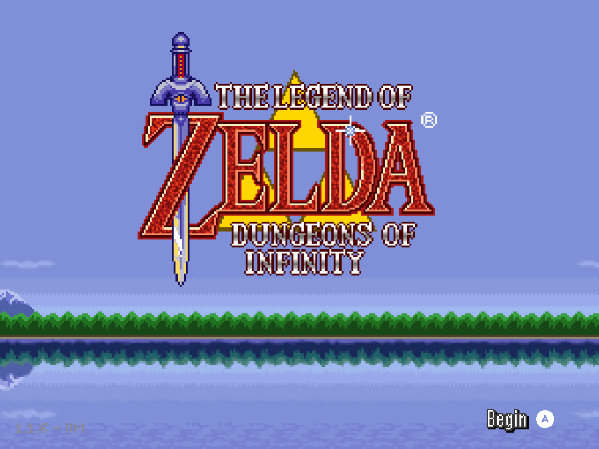

# Dungeons of Infinity: 4:3 edition

A 4:3 layout patch for the Retroid Nova running ROCKNIX, based on the PortMaster **1.1.6 VM** build.

The title screen fills the display while keeping the logo's proportions. Profile menus use the full screen and keep every control visible. During gameplay, a persistent HUD shows health, magic, the equipped item, rupees, bombs, arrows, and keys. Compact side panels start hidden.

## Install on the Nova

Install PortMaster on ROCKNIX and connect the Nova to Wi-Fi.

1. Download the **Nova patch installer ZIP** from the [latest release](https://github.com/saschb2b/The-Legend-of-Zelda-Dungeons-of-Infinity-4-3/releases/latest).
2. Extract the ZIP and copy both items into `/storage/roms/ports/`:

   ```text
   ports/
   ├── Install Zelda Dungeons of Infinity 4-3.sh
   └── zeldadoi-43-installer/
   ```

3. Refresh the game list and run **Install Zelda Dungeons of Infinity 4-3** from Ports.
4. Wait for installation to finish, then launch **Zelda Dungeons of Infinity 4-3**.

The download contains an installer and a binary patch. It contains no game archive, runtime, or game artwork. The installer downloads the official PortMaster package, verifies its checksum, and applies the patch locally. Allow about 300 MiB of free space for installation.

Saves go in `zeldadoi-43/savedata/`. To update, close the game, replace the installer files with the latest release, and run the installer again. It preserves existing saves. Installation failures appear in `zeldadoi-43-installer/install.log`.

## Controls and layout

The HUD follows the classic Zelda layout. Magic and the equipped item sit on the left, counters across the top, and hearts on the right. It uses the game's sprites, live values, item quantities, and low-health pulse.

Click the **right stick** to show or hide equipment, attack/defence, the minimap, and dungeon progress. These panels sit below the HUD and start hidden for each run. A small right-stick glyph marked **PANELS** appears at the bottom right while the panels are hidden. Menus and dialogue hide the HUD, hint, and panels to keep their controls readable. **Select + Start** returns to Ports.

The title screen uses a centered 300×225 view. Profile menus use a taller 400×300 view with a tiled background. Gameplay presents the complete 256×224 playfield at 4:3 with horizontal pixel aspect correction. The side panels use 75% scale and 90% opacity. The CRT option processes the playfield and HUD together.

| Title screen | Profile menu |
| --- | --- |
|  |  |

| Panels hidden | Panels visible |
| --- | --- |
|  |  |

The launcher selects Freedreno and SDL's evdev controller backend. Testing covers the Retroid Nova on ROCKNIX.

## Rebuild the patch

Install Python 3.9 or newer with virtual environment support and `unzip`. Download [UndertaleModTool CLI 0.9.2.0](https://github.com/UnderminersTeam/UndertaleModTool/releases/tag/0.9.2.0). Create `.build/`, then download the pinned [PortMaster archive](https://github.com/PortsMaster-MV/PortMaster-MV-New/releases/download/2024-12-03_1532/zeldadoi.zip) to `.build/port.zip`.

Run from the repository root:

```sh
mkdir -p .build dist
python3 -m venv .build/patchenv
.build/patchenv/bin/pip install -r requirements-build.txt
unzip -p .build/port.zip zeldadoi/zeldadoi.port > .build/original.port
unzip -p .build/original.port assets/game.droid > .build/game.droid
/path/to/UndertaleModCli load .build/game.droid -s apply.csx -o .build/patched-game.droid -f -v
.build/patchenv/bin/python package_release.py --original-game .build/game.droid --patched-game .build/patched-game.droid --version 1.2.1 --output dist/Dungeons-of-Infinity-4-3-v1.2.1-Nova-Patch-Installer.zip
python3 -m unittest test_install.py
```

`package_release.py` updates the binary patch and `manifest.json`, verifies the patch against the compiled game, and creates the installer ZIP. Use an unused output filename. Build inputs and full game archives stay outside Git. The installer needs only Python's standard library, which ROCKNIX includes.

The verbose CLI flag permits the original game's audio alignment warning. The patch script adjusts the code and room views. The manifest records the source, patch, and output checksums.

## Credits

Justin Bohemier created Dungeons of Infinity. The [PortMaster package](https://github.com/PortsMaster-MV/PortMaster-MV-New/tree/main/ports/zeldadoi) supplies the game files and [GMLoader-next](https://github.com/JohnnyonFlame/gmloader-next) runtime during installation. The installer preserves the upstream license files in `zeldadoi-43/license/`. The release builder uses [bsdiff4](https://pypi.org/project/bsdiff4/) to create the binary patch.
