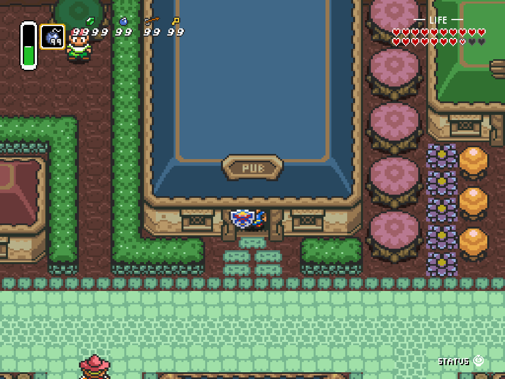
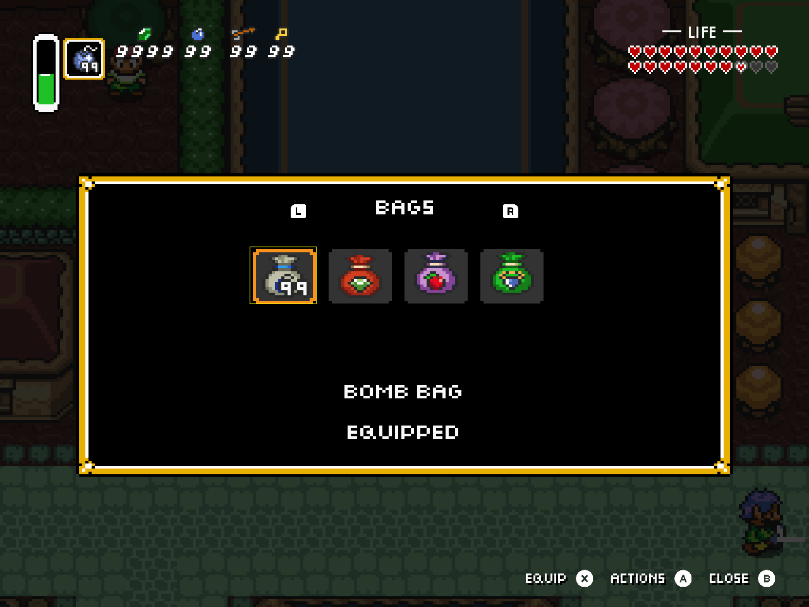
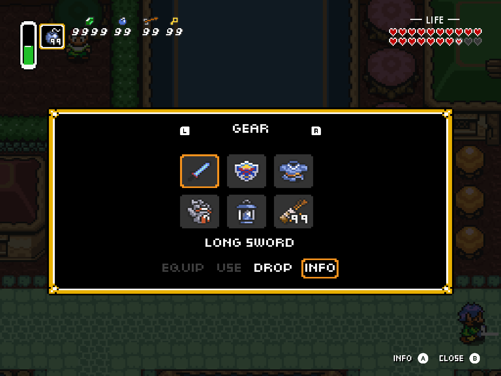
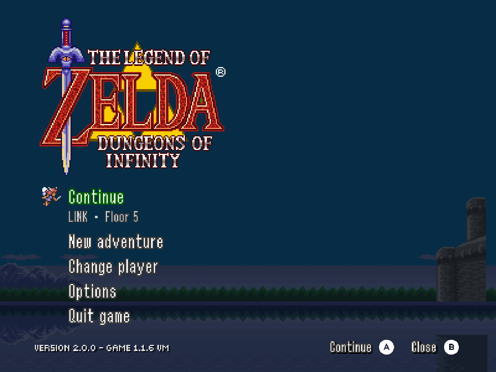
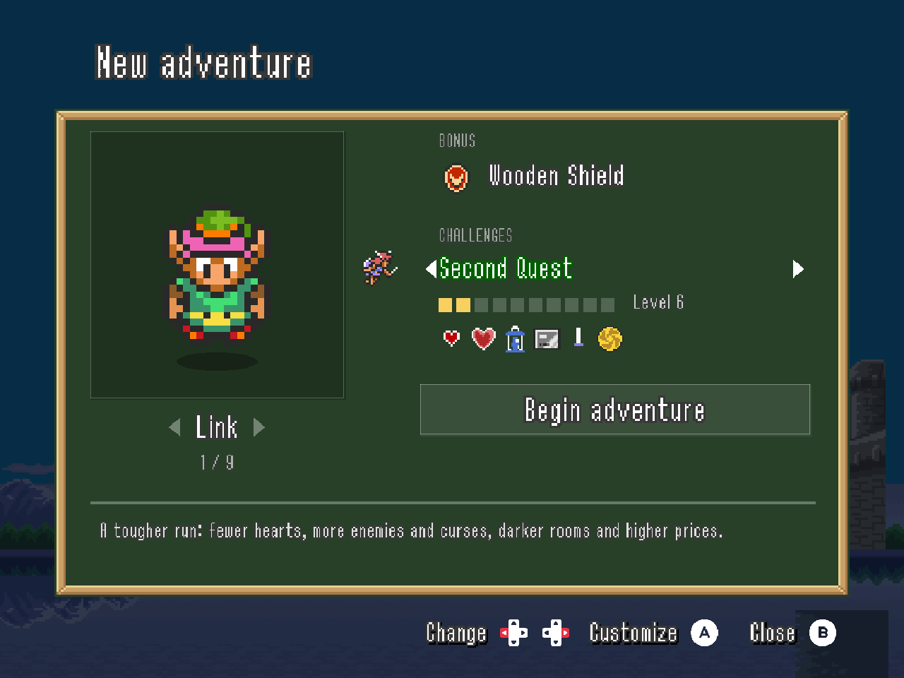
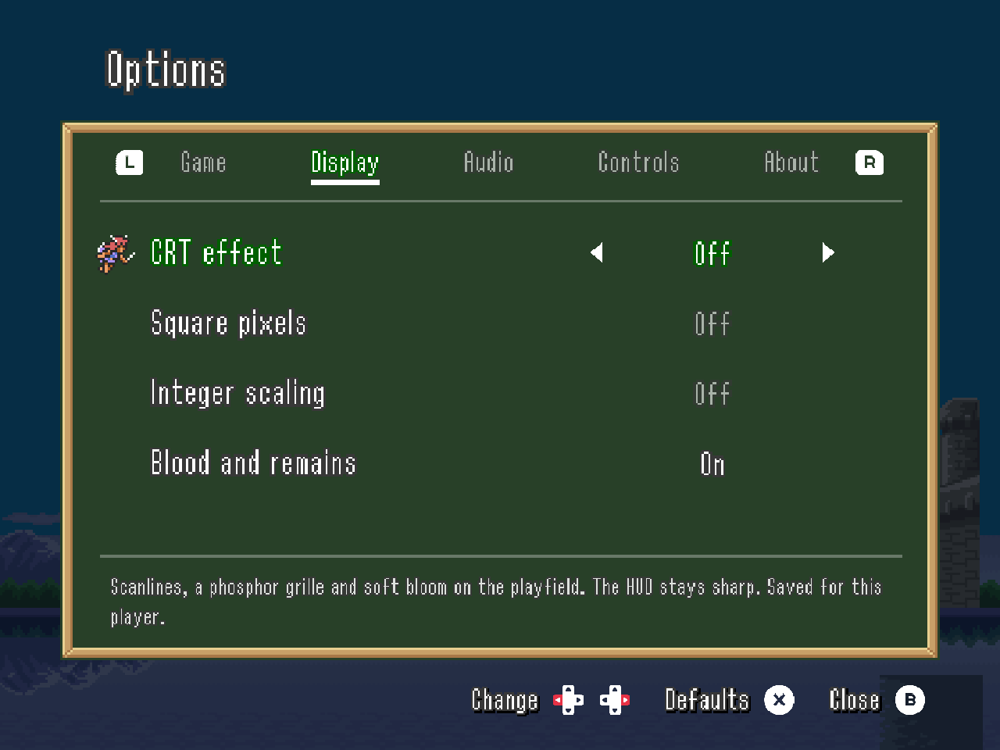

# Dungeons of Infinity: 4:3 edition

**The full dungeon on your Retroid Nova.**

Play Dungeons of Infinity fullscreen on ROCKNIX, with a classic Zelda HUD and a layout made for the Nova's 4:3 display. Keep health, magic, your active item, and supplies in view. Click the right stick when you need equipment, the map, or dungeon progress.

[**Download the installer**](https://github.com/saschb2b/The-Legend-of-Zelda-Dungeons-of-Infinity-4-3/releases/latest) · [Installation](#install-on-the-nova) · [Controls](#controls) · [What's changed](CHANGELOG.md)



- The complete playfield fills the display. Title screens and menus fit too.
- Health and supplies stay visible while status panels open over the game.
- Selected updates from the newer game include inventory bags, sword poke and spin, Topaz, adjustable challenges, and Wallmaster mode.
- Visit the village arcade for the claw machine, or play Mothula's Money in the pub.

## Install on the Nova

You need ROCKNIX, PortMaster, Wi-Fi, and about 300 MiB of free space.

1. Download the **Nova patch installer ZIP** from the [latest release](https://github.com/saschb2b/The-Legend-of-Zelda-Dungeons-of-Infinity-4-3/releases/latest).
2. Extract the ZIP and copy both items into `/storage/roms/ports/`:

   ```text
   ports/
   ├── Install Zelda Dungeons of Infinity 4-3.sh
   └── zeldadoi-43-installer/
   ```

3. Refresh the game list and run **Install Zelda Dungeons of Infinity 4-3** from Ports.
4. Wait for installation to finish, then launch **Zelda Dungeons of Infinity 4-3**.

The installer downloads the official PortMaster package and applies the patch automatically. You do not need to download or patch game files yourself.

**Updating:** close the game, replace the installer files with the newer download, and run the installer again. Your saves stay in `zeldadoi-43/savedata/`. The installer preserves them and keeps migration backups in `zeldadoi-43/save-backups/`.

For updates over Wi-Fi, choose **Options > About > Updates** from the adventure menu. It shows the installed and available patch versions and the changes since your version. Use L/R to page through the notes. Choose **Install update** to download the update and restart the game. Press **B** to close or cancel a download.

The updater checks stable releases only when you open Updates or choose Check again. It verifies downloads before installation and preserves your saves. If installation fails, the previous version remains available. Keep the device powered on during installation.

If installation fails, check `zeldadoi-43-installer/install.log`. For another attempt, run the installer again.

## Controls

These are the default controller bindings. Change them under **Options > Controls**, from the adventure menu or the pause menu. Each button hint follows your current mapping, including keyboard bindings.

| Button | During play | In the inventory |
| --- | --- | --- |
| D-pad / left stick | Move | Highlight an object or action |
| A | Interact | Open Actions, open a bag, or confirm the highlighted action |
| B | Sword | Close the current view |
| X | Use the equipped item | Equip the highlighted object, when available |
| Y | Open the map | |
| Start | Open the inventory | Close the inventory |
| Select | Pause | Close the inventory |
| Right-stick click | Show or hide Status | |
| L / R | | Previous / next inventory page |
| Select + Start | Exit to Ports | Exit to Ports |

Press **B** to close the map, menus, item information, or inventory. Closing an action list or item information returns to the inventory. Closing a pause submenu returns to the pause menu. In name entry, B closes without saving. Choose **Erase letter** to delete a character. On a keyboard, Escape closes or cancels the current view.

At a shop counter, press **A** to inspect an item. In its dialog, A confirms the highlighted choice and **B** closes without buying. Closing also works while reading item information or a purchase refusal.

During play, a hint beside **Status** names the interaction within reach: **Talk**, **Open**, **Lift**, or **Throw** while carrying. Signs show **Read** and shop goods show **Inspect**. The hint follows your Interact binding and disappears when you turn away, open a menu, or lose control during an animation or room transition.

**Actions** opens an object's choices. **Equip** assigns it to the active item button. **Use** activates or consumes it immediately. Gear in dedicated equipment slots is already active. Its action list provides information and, where allowed, Drop.

Use **L/R** to switch inventory pages, or **Page Up/Page Down** on a keyboard. The D-pad stays in the item grid. Health and counters remain visible while browsing or reading item information.

Input hints sit together at the bottom right, with each action label followed by its button. The primary action (A) comes before Close (B), which stays at the far right. Equip and the current action keep fixed positions as inventory contents and labels change. L/R stays beside the page heading, with room reserved for the longest title.

| Inventory below the HUD | Contextual item actions |
| --- | --- |
|  |  |

Inventory and menu screenshots use test saves to show progress and full inventories. All screenshots come from the game running on a Nova.

| Status at a stick-click | Continue your adventure |
| --- | --- |
|  |  |

The centered title screen leads into an adventure menu with your last selected player. Their name and floor sit beneath **Continue**, which resumes the saved run in one press. **New adventure** shows your character beside the bonus and challenges, with a line below explaining the highlighted choice. Press **A** on any row except Challenges to begin, and **Begin adventure** is selected by default. **Random** picks another character. Each player's last setup is remembered. A fresh player starts as Link, with no required name entry.



**Change player** shows each player as a card with their character, floor, play time, hearts, wins and deaths, and it opens on the current player. The line below says when each player last played. Select a player to return to their adventure, or press **Details** for their full records, **Rename** and **Delete player**. Deleting asks first, with Cancel selected, and names the run that will be erased. When renaming, L erases a letter and R adds a space. Starting over an existing save asks for confirmation. Options, controls, updates and credits are available before entering the dungeon.



**Options** opens the same screen from the adventure menu and the pause menu. L/R switch between Game, Display, Audio and Controls, and left/right changes the highlighted setting. Changes apply immediately, and a line below the list explains each setting. **Defaults** restores the current tab after confirmation. Gamepad and Keyboard list every action by group. Choose one and press its new button; a button another action already uses swaps between them. Changed actions are marked, the help line shows the default, and **Reset** restores just the highlighted action. **Restore all defaults** at the end of the list asks first. Menu Confirm (A), Back (B) and Pause (Select) stay fixed, so remapping can never lock you out of the menus. Select cancels a remap, which also stops after ten seconds. Music and sound effects have ten volume steps; zero mutes them. Controls, CRT and item messages are saved for each player. Volume, blood and title skipping apply to the whole device. Updates and credits are under **About** in the adventure menu.

## Playing and updating

The village on floor 6 has two more minigames. The claw costs ten rupees: move left/right and grab with A. In the pub, L/R changes the slot bet and A plays. B closes either game.

Hold Sword after a swing to poke while moving. With a level-three sword or higher, hold until the blade flashes, then release to spin. Level-two swords can break pots.

Choose a challenge preset with left/right: **Hero's Path** is the standard game, **Second Quest** is tougher, and **Master Quest** is for veterans. The level meter adds up every challenge, and icons show which ones are active. Press **A** on Challenges to customize health, darkness, inventory space, shop prices and other restrictions; each explains itself, changed values are marked, and **Defaults** restores Hero's Path after asking. The last page includes No map, No food, and Wall Master. Existing runs keep their original challenge restrictions, and saves started with challenges show their level beside the floor.

Press Start or confirm to skip the opening title animation. To require the full animation, turn off **Skip title intro** under **Options > Game**.

This is an unofficial patch of the PortMaster **1.1.6 VM** build with selected 1.2.x backports. It does not include every change from 1.2.1. Read the [backport audit](docs/BACKPORTS.md) for coverage and the [changelog](CHANGELOG.md) for changes between patch releases.

<details>
<summary>Save migration and returning to an older patch</summary>

Existing inventory migrates on load. Excess items remain available on overflow pages.

The installer preserves saves before each format change:

- `save-backups/before-inventory-v1.zip`: before the inventory update.
- `save-backups/before-content-v3.zip`: before Topaz and variable challenges.

Reinstallation preserves both backups. Keep them if you plan to return to an earlier patch, which may require the matching older saves.

</details>

## Development and testing

The repository distributes patch code and binary deltas. Installer downloads contain no standalone game or runtime. Checksums verify the upstream package and patched output.

[TESTING.md](docs/TESTING.md) covers builds, GitHub CI, the isolated Nova regression suite, and the release procedure. Patch versions are independent of the original game's versions. Related fixes stay under Unreleased until the batch is ready.

<details>
<summary>Build the patch on Linux</summary>

Use Linux x86-64 and Python 3.11 or newer:

```sh
python3 -m unittest discover -v
python3 build.py --check-release --runtime-tests
```

The build downloads the pinned PortMaster package and UndertaleModTool CLI 0.9.2.0, checks their hashes, and compiles the patch. It verifies the checked-in delta against the clean build, then tests installation and reinstallation. Full game archives stay in the ignored `.build/` directory.

GitHub Actions runs the unit suite and build checks on pushes and pull requests. Runtime assertions run separately on a Nova. The installer uses Python's standard library. Release packaging uses `requirements-build.txt`.

</details>

<details>
<summary>Rendering and device support</summary>

Testing covers the Retroid Nova on ROCKNIX. The launcher selects Freedreno and SDL's evdev controller backend.

Gameplay presents the complete 256×224 playfield at 4:3 with horizontal pixel aspect correction. The title uses a centered 300×225 view, and profile menus use a 400×300 view. Status panels use 75% scale and 90% opacity.

The HUD renders after the playfield at its own integer scale, with square pixels and a smaller footprint. On the Nova's 1280×960 screen, it uses 3× scaling. Equipment and counters sit at the left edge, with hearts at the right. The CRT option affects the world while the HUD and gameplay hints stay crisp.

Inventory, map and arcade hints share the HUD scale, footer baseline and right margin. Smaller L/R glyphs stay beside the inventory heading. Item artwork and descriptions retain their larger scale for browsing.

Enable **CRT** for shaped scanlines, a phosphor grille and soft bloom. The CRT-Lottes port keeps the full playfield visible and preserves dark detail. Arcade machines use their original effect.

</details>

## Credits

Justin Bohemier created Dungeons of Infinity. The [PortMaster package](https://github.com/PortsMaster-MV/PortMaster-MV-New/tree/main/ports/zeldadoi) supplies the game files and [GMLoader-next](https://github.com/JohnnyonFlame/gmloader-next) runtime during installation. The installer preserves upstream license files in `zeldadoi-43/license/`.

Controller glyphs use Kenney's Input Prompts 1.5A, from `Nintendo Switch 2/Double`, under [CC0](assets/buttons/LICENSE.txt). [The asset manifest](assets/buttons/manifest.json) records source filenames and checksums. The patch copies this artwork without redrawing it.

The gameplay CRT shader adapts Timothy Lottes' public-domain CRT-Lottes shader from RetroArch. [Shader source and tuning notes](src/shaders/README.md) document the port and its attribution.

The release builder uses [bsdiff4](https://pypi.org/project/bsdiff4/) to create the binary patch.
